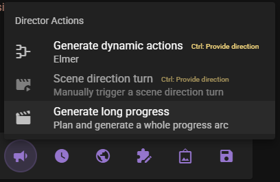
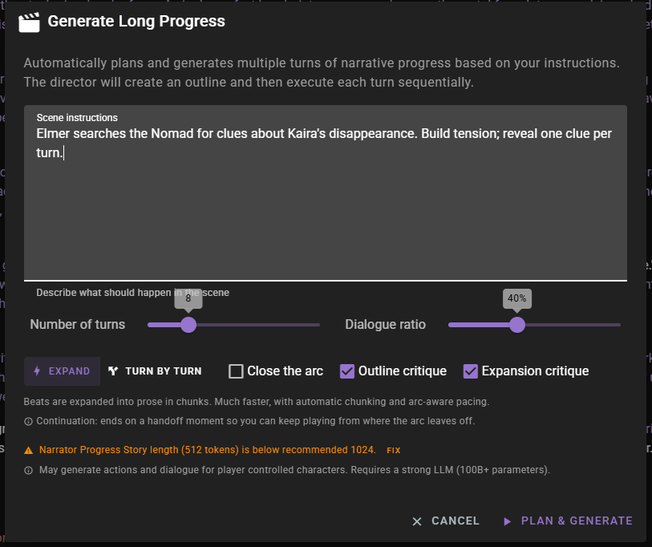
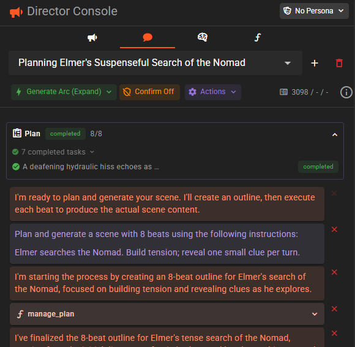
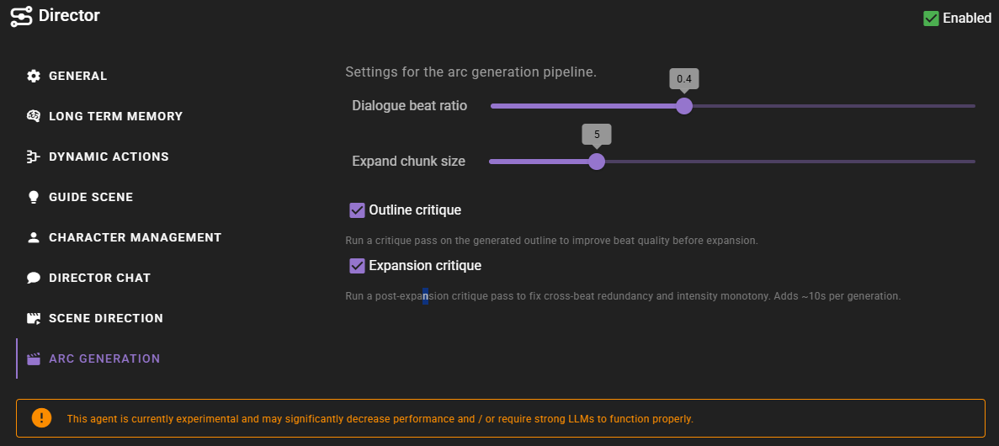
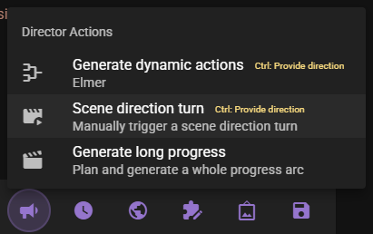

# Director Planning

!!! info "New in 0.37.0"

Director Planning lets the director break a goal into a task list, track progress against that list, and — depending on how the plan was created — optionally execute each task itself. Plans surface in the [Director Console](/talemate/user-guide/agents/director/chat) as a **Plan** banner above the chat, regardless of which flow created them.

There are two distinct flows that create a plan:

- **Autonomous planning during chat.** While you are talking to the director in a normal chat mode (Normal, Decisive, or No Spoilers), the director can decide on its own to build a short task list for work it is about to do. It ticks tasks off as it completes them using its other actions. The plan is a lightweight todo list, not an auto-executing beat queue.
- **Generate long progress.** A dedicated dialog on the scene tool bar that creates a multi-beat scene arc and executes every beat sequentially in a fresh chat. Use this when you want to generate a chunk of story at once.

Both flows use the same underlying plan schema and appear in the same Plan banner, but they differ in scope, what triggers them, and whether the director executes the plan automatically.

!!! warning "Strong LLM recommended"
    A strong language model (100B+ parameters) with reasoning enabled is highly recommended for either flow. Planning produces structured output and involves multiple generation steps — weaker models can produce malformed tasks, malformed beats, or repetitive prose. See [Reasoning Model Support](/talemate/user-guide/clients/reasoning/).

## Planning during chat (autonomous)

In **Normal**, **Decisive**, or **No Spoilers** director chat mode, the director has access to a `manage_plan` action that it can invoke on its own to:

- Create a task list for work it is about to do.
- Mark individual tasks as completed as it works through them.
- Replace or delete the plan when its strategy changes.

The director decides whether to create a plan based on your chat instructions. A single-action request (for example, "narrate the door opening") almost never triggers one; a multi-step request ("have the guards arrive, search the room, then find the note") typically does.

You do not interact with the plan directly — it is the director's own scratchpad. As tasks are completed, the chips in the Plan banner update; when the director considers the plan finished, the banner status flips to **completed**. To abandon a planned direction, just give the director new instructions in the chat — it will typically replace or delete the plan on its next turn.

!!! note "Todo list, not an execution queue"
    Autonomous plans do not run beats automatically. Each task is satisfied when the director takes a separate action (directing the scene, querying context, narrating, and so on). This is the key difference from the Generate long progress flow below, where beats execute automatically and sequentially.

## Generate long progress (manual)

Use this flow when you want the director to both plan and execute a chunk of story in one go. The entry point is the **Generate long progress** item in the director section of the scene tool bar. Click the :material-bullhorn: director menu above the scene input and choose **Generate long progress**.

This opens the Generate Long Progress dialog:

### Scene instructions

Describe what should happen in the scene. This is the seed for the whole arc — the director will use it to produce the outline. Be as brief or as detailed as you like; everything else on the dialog controls shape and pacing, not content.

### Number of turns

How many beats to plan. A beat is one unit of narration or dialogue in the outline. The default is 8, and the slider ranges from 3 to 24.

### Dialogue ratio

Target fraction of beats that should be dialogue versus narration. `40%` means roughly 40% of the beats will be dialogue and the rest will be narration, action, reveal, or transition. The slider moves in 10% steps.

The default value comes from the agent-level **Dialogue beat ratio** setting (see [Settings](#settings) below) and can be changed per run.

### Execution mode

Two modes are available, toggled with the button group near the bottom of the dialog:

#### :material-lightning-bolt: Expand

Beats are expanded into prose in chunks. The director assigns each chunk an arc position (setup, rising action, climax, falling action) and pacing metadata, then generates the prose for multiple beats in a single pass. This is significantly faster than turn-by-turn execution and produces more cohesive cross-beat writing because the model sees several beats at once.

#### :material-directions-fork: Turn by turn

Each beat is executed individually through the narrator and conversation agents, the same way the director normally progresses the scene one message at a time. This is slower, but the director can adjust its strategy between beats — for example, if an earlier beat took the story in an unexpected direction.

### Close the arc

Controls how the planned arc ends.

- **Off (default — continuation)**: the arc ends on a high-tension handoff moment so you can keep playing from where it leaves off.
- **On (closed arc)**: the arc lands a full resolution, including a character choice and wind-down. Use this when you are writing a self-contained short story.

This setting resets to continuation mode every time you open the dialog.

### Outline critique

When enabled, the director runs a critique pass on the generated outline before executing any beats. This helps catch weak pacing, redundant beats, or missing setups in the plan before time is spent generating prose.

Enabled by default.

### Expansion critique

Only visible when **Expand** mode is selected. When enabled, the director runs a second critique pass over the expanded prose to fix cross-beat redundancy, intensity monotony, and repeated vocabulary. Adds roughly 10 seconds per generation.

Enabled by default.

### Warnings

The dialog surfaces a few pre-flight checks:

- **Narrator progress story length** — if the narrator's progress-story response length is below the recommended minimum (1024 tokens) the dialog offers a quick **Fix** button that jumps to the narrator's generation override settings.
- **Missing acting instructions** — lists any active characters that do not have dialogue instructions set. The plan will still run, but those characters may produce weaker dialogue.
- **Player characters** — planning may generate actions and dialogue for player-controlled characters. There is no way to exclude them from the arc.

## What happens when you click Plan & Generate

Clicking **Plan & Generate** does three things:

1. Creates a new director chat in **Generate Arc** mode (or **Generate Arc (Expand)** mode, depending on your selection). Your scene instructions are inserted as the opening user message, and action confirmation is turned off for this chat so the flow runs end to end without prompts.
2. Opens the [Director Console](/talemate/user-guide/agents/director/chat) so you can watch the flow run.
3. Kicks off the planning pipeline: the director produces an outline, optionally critiques it, and then executes each beat.

You can keep using the scene normally once the run has produced output — generated narration and dialogue are pushed to your scene feed as they are produced.

## Watching a plan run

Whenever a plan is active — whether it was created autonomously by the director or by the Generate Long Progress dialog — a **Plan** banner appears at the top of the Director Console chat with the current status, completed-task count, and a compact task list that windows to the active task:

The banner statuses map to the planning pipeline:

| Status | Meaning |
|---|---|
| `planning` | Director is producing the plan or outline. |
| `ready` | Plan is built; tasks are available. |
| `executing` | At least one task/beat is running. |
| `completed` | All tasks are done. |
| `cancelled` | The plan was stopped before finishing. |

Each task in the banner has its own icon and status chip — pending, executing, completed, or skipped. Click the chevron at the top-right of the banner to collapse it; click the "N completed tasks" or "N more pending tasks" summaries to expand and show the whole list.

In the Generate Long Progress flow the banner runs through `planning` → `ready` → `executing` → `completed` as the arc executes. In autonomous planning, the banner typically sits in `ready` while the director ticks tasks off one by one using its other actions.

### Chat modes created by planning

When the plan dialog creates a chat, the director-chat mode chip in the toolbar shows **Generate Arc** (:material-directions-fork:) or **Generate Arc (Expand)** (:material-lightning-bolt:), matching the execution mode you chose. These modes are also selectable from the mode menu if you want to convert an existing chat, though the usual entry point is the dialog.

See [Director Chat](/talemate/user-guide/agents/director/chat#chat-modes) for the other available chat modes.

## Settings

The agent-level defaults for planning live under **Arc Generation** in the director's agent settings panel:

##### Dialogue beat ratio

Default target fraction of beats that are dialogue. Range `0.0`–`1.0`, step `0.1`. The plan dialog pre-fills its **Dialogue ratio** slider from this value.

##### Expand chunk size

Maximum number of beats bundled into one expansion call in Expand mode. Range `3`–`12`, default `5`. Larger chunks produce more cohesive prose across beats but consume more context per call.

##### Outline critique

When enabled, the critique pass on the outline runs by default. The plan dialog mirrors this into its **Outline critique** checkbox and you can override it per run.

##### Expansion critique

When enabled, the post-expansion critique pass runs by default in Expand mode. The plan dialog mirrors this into its **Expansion critique** checkbox and you can override it per run.

## Manual scene direction turn

!!! info "New in 0.37.0"

The director menu in the scene tool bar also includes a **Scene direction turn** button that manually triggers one [Autonomous Scene Direction](/talemate/user-guide/agents/director/scene-direction) turn. It is useful when you have Scene Direction enabled but auto-progression turned off — you can step the director through the scene one turn at a time instead of letting it drive the game loop.

- **Click** to run a single scene direction turn using your current settings and intentions.
- **Ctrl+click** (Cmd+click on macOS) to open an instructions dialog. Whatever you type is inserted into the scene direction history as a one-off user direction before the turn executes, letting you nudge the director for just that turn without changing your scene-level instructions.

The button is greyed out when Scene Direction is disabled in the [director agent settings](/talemate/user-guide/agents/director/scene-direction#enabling-scene-direction).

## Troubleshooting

### The plan stops or reports a malformed-output error

Expand mode validates each chunk and retries up to three times if the model produces blocks with leaked tags. If all three attempts fail, the run stops with an error telling you the model is likely too weak for structured generation. Try a stronger model, or switch to **Turn by turn** mode which uses the same per-turn pipeline as normal play.

### Beats feel repetitive or drift off-course

- Enable **Outline critique** to catch weak pacing before beats are generated.
- In Expand mode, keep **Expansion critique** on so the post-expansion pass can de-duplicate repeated vocabulary and flatten intensity plateaus.
- Reduce the number of turns — very long plans (toward 24) give the model more room to repeat itself.

### The arc ends too abruptly or too neatly

Toggle **Close the arc**. With it off, the arc is meant to end on a handoff moment; with it on, the arc is meant to resolve. If you want something in between, use a smaller beat count and run another plan afterwards.
