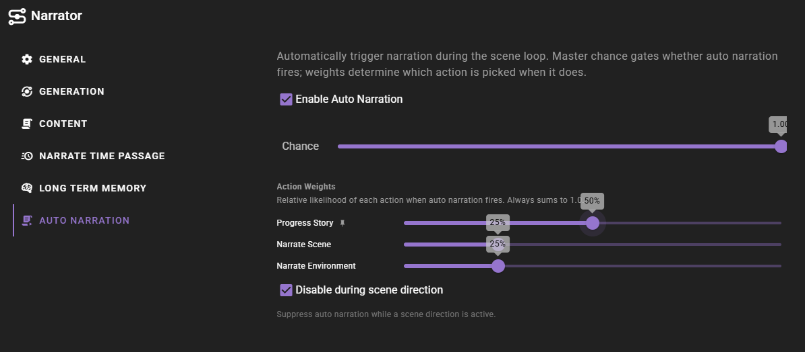

# Auto Narration

!!! info "New in 0.37.0"

    Auto Narration replaces the previous **Narrate after Dialogue** action. The old action fired a fixed post-dialogue narration after every character turn; Auto Narration is a probability-gated dispatcher that can fire any one of three narration types and only does so on a configurable fraction of turns.

Auto Narration lets the narrator inject narration on its own during play. Each time an actor takes a turn, the narrator rolls a master chance. If the roll succeeds, it picks one narration type from a weighted pool and runs it. The dispatcher fires on every actor turn, not just yours — so AI character turns can also be followed by narration.

Auto Narration is disabled by default. The :material-script-text-play: **Auto Narration** quick toggle is exposed in the narrator's agent panel next to its other quick toggles.

## What it does on a turn

After each actor takes a turn, the narrator runs a single decision:

1. Is Auto Narration enabled? If not, skip.
2. Is **Disable during scene direction** on, and is the director's [Scene Direction](/talemate/user-guide/agents/director/scene-direction) currently enabled (agent toggle or scene-level override)? If yes, skip.
3. Roll a random number. If it is greater than or equal to **Chance**, skip.
4. Pick one action from the action weights, weighted by their slider values.

Only when all four gates pass does narration actually fire. Any non-zero result the random roll produces is logged at debug level under the `talemate.agents.narrator.auto_narration` logger, so you can trace why a turn did or did not narrate when troubleshooting.

## Configuration

The settings live under the **Auto Narration** section in the narrator agent panel.

### Chance

Master probability that anything fires on a given actor turn. Range `0.0`–`1.0`, step `0.05`.

- `0.0` — never fires (effectively the same as turning Auto Narration off).
- `0.5` — fires roughly every other turn.
- `1.0` — fires every turn.

The chance roll runs *after* the feature-toggle and scene-direction gates, so flipping Chance to `0` does not bypass those gates — it only stops the roll from succeeding.

### Action Weights

When the chance roll succeeds, the narrator picks one of three actions weighted by these sliders:

| Action | What runs | Length budget |
|---|---|---|
| **Progress Story** | The same prompt as the [Progress Story](/talemate/user-guide/scenario-tools#progress-story) scene-tool action — moves the story forward. | `Progress Story` length |
| **Narrate Scene** | The same prompt as the [Look at Scene](/talemate/user-guide/scenario-tools#look-at-scene) scene-tool action — visually-focused description of what is currently happening. | `Scene Narration` length |
| **Narrate Environment** | The same prompt as the [Narrate Environment](/talemate/user-guide/scenario-tools#narrate-environment) scene-tool action — post-dialogue ambience and reactions, focused on sensory information. Internally calls `narrate_after_dialogue`, the same method the removed Narrate after Dialogue action used. | `After Dialogue` length |

Length budgets come from the per-narration-type settings under [Generation Length Per Narration Type](/talemate/user-guide/agents/narrator/settings#generation-length-per-narration-type) and are not overridden when Auto Narration fires the action.

#### Auto-rebalancing sliders

The three sliders always sum to `1.0`. Dragging one auto-redistributes the other two:

- The slider you released last is **pinned** — a small :material-pin: icon appears next to its label and its value stays put while you adjust a different slider.
- The remaining slider absorbs whatever change is needed to keep the sum at `1.0`.

This means you can lock in one weight, then shape the trade-off between the other two without losing the value you set first. Step size is `0.05` (5%) per click.

A weight of `0` removes that action from the pool entirely. The chance roll still happens; if it succeeds, it picks from the remaining non-zero actions. If every weight is zero (which the rebalancer normally prevents), nothing fires.

### Disable during scene direction

Default on. When [Scene Direction](/talemate/user-guide/agents/director/scene-direction) is enabled — either via the director's agent toggle or a scene-level always-on override — Auto Narration is suppressed. The reasoning: Scene Direction is already deciding when narration should run, so layering Auto Narration on top tends to produce duplicate or competing narration.

Turn this off only if you want both systems running independently.

## Troubleshooting

### Auto narration never fires

- Check that **Auto Narration** is enabled (quick toggle or expand the section in the agent panel).
- Check that **Chance** is greater than `0`.
- Check whether Scene Direction is enabled on the [Director](/talemate/user-guide/agents/director/scene-direction) — if it is, Auto Narration is suppressed by default. Either disable Scene Direction or turn off **Disable during scene direction** in the Auto Narration settings.
- Confirm at least one **Action Weight** is greater than `0`.

For deeper investigation, set the `talemate.agents.narrator.auto_narration` logger to debug. Each gate logs a `skip=` reason (`disabled`, `scene_direction`, `chance_zero`, `chance_roll`, or `no_candidates`), and successful selections log the chosen action with the roll, chance, and weights.