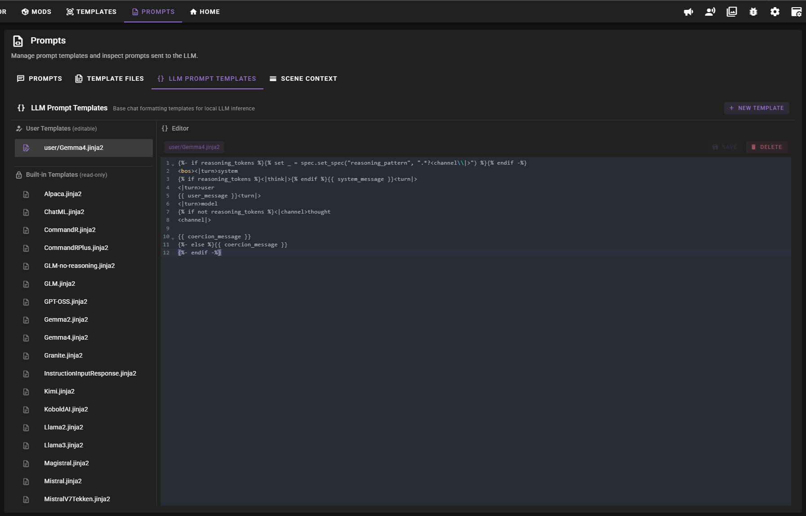
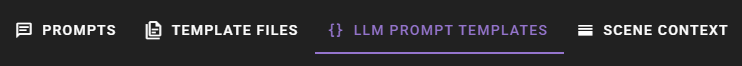
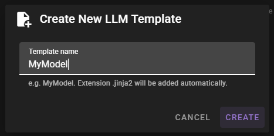
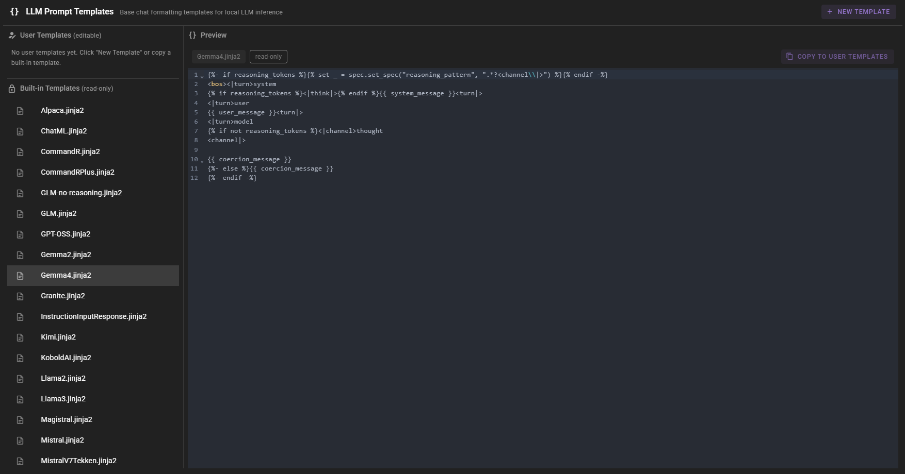
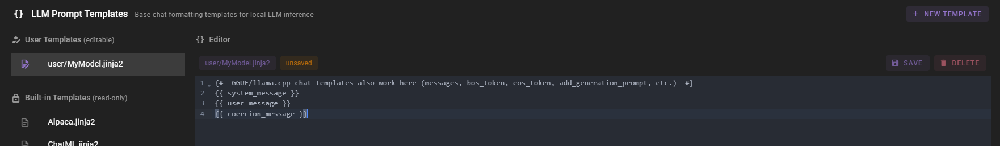

# LLM Prompt Templates

!!! info "New in 0.37.0"
    The **LLM Prompt Templates** tab lets you view, create, edit, and delete base chat-format templates from within the Prompt Manager. User templates are stored separately from the built-ins and are preserved across updates.

The **LLM Prompt Templates** tab manages the base chat-format templates used for local LLM inference -- the per-model wrappers like `ChatML`, `Llama3`, `Mistral`, or `Gemma4` that decide how system, user, and assistant turns are tokenized before being sent to the model.

These are different from the Jinja2 agent templates covered in the [Prompt Manager](index.md). Agent templates build the *content* of a prompt; LLM prompt templates wrap that content in the format a specific model expects.

## Accessing the Tab

Open the **Prompts** view from the main toolbar and select the **LLM Prompt Templates** tab.

The tab is split into two panels:

- **List panel** (left) -- shows your **User Templates** (editable) on top and **Built-in Templates** (read-only) below.
- **Editor panel** (right) -- previews the selected template, or opens it for editing when you select a user template.

## Built-in vs User Templates

| Source | Location | Editable | Notes |
|--------|----------|----------|-------|
| **Built-in** | `templates/llm-prompt/std/` | No | Ship with Talemate. Updated with each release. |
| **User** | `templates/llm-prompt/std/user/` | Yes | Your templates. Gitignored, never overwritten by updates. |

When a client looks up a prompt template by model name, both built-in and user templates are searched. User templates are listed in the model picker with a `user/` prefix (for example `user/MyModel`).

## Creating a New User Template

Click **New Template** in the tab header to open the create dialog.

1. Enter a name (the `.jinja2` extension is added automatically).
2. Click **Create**.

The new template is saved to `templates/llm-prompt/std/user/` with a minimal starter body and is opened in the editor so you can fill it in.

Names are sanitized: they cannot contain slashes, backslashes, or any of the characters `< > : " | ? *`.

## Copying a Built-in Template

Built-in templates cannot be edited directly. To customize one, copy it into your user templates:

1. Select the built-in template in the list.
2. Click **Copy to User Templates** in the editor header.

A new user template with the same filename is created in `std/user/` and automatically selected for editing. If a user template with that name already exists, you will see a warning and need to delete or rename the existing copy first.

## Editing a User Template

Select a user template from the list. The editor opens with the full Jinja2 source.

- An **unsaved** chip appears in the header as soon as the content differs from the saved file.
- Click **Save** to write the changes back to disk.
- Click **Delete** to permanently remove the template. A confirmation prompt is shown.

## Using GGUF / llama.cpp Chat Templates

Chat templates pulled from a GGUF model's `tokenizer_config.json` (or the matching `chat_template.jinja2` on a Hugging Face model repo) can be pasted directly into a user template. The following variables used by those templates are provided by Talemate when rendering:

| Variable | Description |
|----------|-------------|
| `messages` | List of `{role, content}` dicts (roles: `system`, `user`, `assistant`). |
| `bos_token`, `eos_token` | Empty strings -- Talemate does not add BOS/EOS itself; if the model requires them, include the literal tokens in the template. |
| `add_generation_prompt` | Always `True`. |
| `enable_thinking` | `True` when reasoning tokens are enabled on the client, otherwise `False`. |
| `thinking_budget` | The client's reasoning token count, or `0`. |
| `strftime_now(fmt)` | Helper that returns the current time formatted with `strftime`. |
| `raise_exception(msg)` | Helper compatible with GGUF templates that emit errors. |

Talemate's native variables (`system_message`, `user_message`, `coercion_message`, `reasoning_tokens`, `spec`) remain available in the same template, so you can mix a GGUF template with Talemate-specific features if needed.

## Assigning a Template to a Client

Adding or editing a template here only makes it available -- it does not automatically assign it to any client. To use a template with a specific model:

1. Open **Clients** from the main toolbar and edit the client.
2. Pick the template from the **Prompt Template** dropdown. User templates appear prefixed with `user/`.

See [Prompt Templates](../clients/prompt-templates.md) for how clients resolve templates from a model name and [Template Locking](../clients/template-locking.md) for locking a client to a specific template.

## Outdated Override Warning on the Prompts Tab

The top-level **Prompts** tab in the main navigation shows a small warning icon when any of your active Jinja2 template overrides (managed from the [Prompt Manager](index.md#active-tab-resolved-template-tree)) are older than the built-in default they override. This happens most often after an update that ships improvements to default templates.

The icon is an alert, not a tab count. Open the Prompt Manager and check the **Active** tab to see which templates are flagged as outdated, then review or delete those overrides as needed.

This warning tracks Jinja2 agent template overrides only. It is not related to the LLM prompt templates described on this page -- user LLM prompt templates are not compared against built-ins and therefore never show as outdated.
