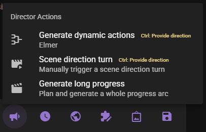
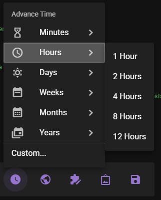
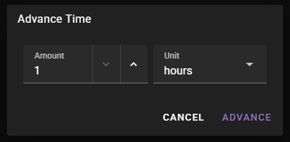
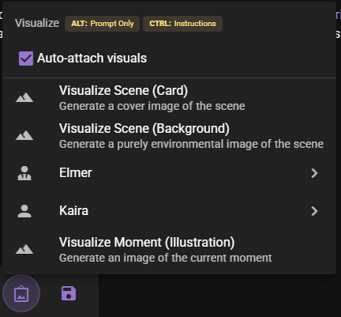
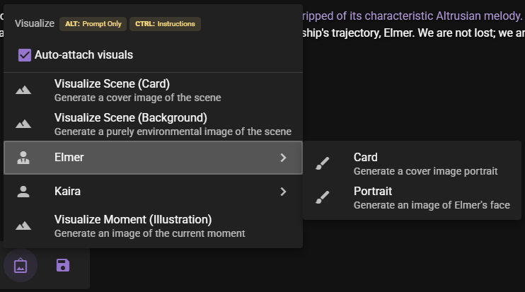

# Scene Tools

!!! note "Mac users"
    Throughout this guide, hold **Cmd** wherever **Ctrl** is mentioned. macOS reserves `Ctrl`+click for the system context menu, so Talemate also accepts the Command key as the primary modifier on every click and shortcut.

## Agent Activity Bar

Above the scene tools, you may notice a row of small chips appearing and disappearing. This is the **Agent Activity Bar**, which shows you which agents are currently working in the background.

When an agent becomes active, a chip appears displaying:

- The **agent's name** (e.g., Narrator, Director, Summarizer)
- The **current action** being performed (e.g., "Analyzing", "Generating", "Processing")

Agents appear in the order they became active, with the oldest on the left and the newest on the right. As agents complete their work, their chips fade away.

This feature provides visibility into what's happening behind the scenes without needing to look at the system bar at the top of the screen. It's especially useful when multiple agents are working simultaneously.

The agent activity bar can be toggled on or off in [Settings > Game > General](/talemate/user-guide/app-settings/game#show-agent-activity-bar). It is enabled by default.

## Tool Bar

<!--- --8<-- [start:tools-ux] -->

<!--- --8<-- [end:tools-ux] -->

#### :material-refresh: Regenerate AI response

This will regenerate the most recent message, if it is an AI generated message.

!!! note "Keyboard modifiers"
    If you hold `ctrl` when clicking this button you will be prompted to supply some instructions for the
    regeneration. This can be useful to guide the AI in a certain direction.

    If you hold `ctrl+alt` when clicking this button you will be prompted to supply some instructions for the
    regeneration while keeping the original message as context. This is useful for rewrites.

!!! info "Previous versions are kept"
    Regenerating doesn't throw away the old message -- each result is added to the message's revision history, which you can browse with the paginator above the message. See [Message revision history](/talemate/user-guide/interacting#message-revision-history).

#### :material-nuke: Regenerate AI Response (nuke option)

This will regenerate the most recent message, if it is an AI generated message, but with a higher temperature and repetition penalties applied, which can lead to more creative responses. Use this to break out of repetitive loops.

!!! note "Keyboard modifiers"
    If you hold `ctrl` when clicking this button you will be prompted to supply some instructions for the
    regeneration. This can be useful to guide the AI in a certain direction.

    If you hold `ctrl+alt` when clicking this button you will be prompted to supply some instructions for the
    regeneration while keeping the original message as context. This is useful for rewrites.

### :material-account-voice: Actor Actions

Will open a context menu that allows you to have the actor perform actions.

!!! info "Recommendation"
    Turn auto progress off if you want full control and use these actions to guide the scene.

    

#### :material-comment-account-outline: Actor Action (Specific Character)

Will pick a character to performan an action.

##### Hold ctrl to provide direction

If you hold the `ctrl` key while clicking the menu item it will prompt you for a direction to inform the character's action.

Depending on what the `Actor Direction Mode` setting in the [:material-bullhorn: Director Agent Settings](/talemate/user-guide/agents/director/settings/#actor-direction-mode) the direction will either be given as an instruction or as inner monologue.

Regardless of mode you should write your instruction so it completets the following sentence: `I want you to ...`

Some examples:

> be angry at the other character

or

> be annoyed at the situation and storm off

#### :material-comment-text-outline: Actor Action

Automatically picks a character to generate dialogue and actions based on the current scene state.

### :material-bullhorn: Director Actions

Opens a context menu with director-driven actions for the scene.

#### :material-tournament: Generate dynamic actions

Asks the director to generate a set of clickable action choices for the current player turn. See [Dynamic Actions](/talemate/user-guide/agents/director/settings/#dynamic-actions) for how to configure this.

!!! note "Keyboard modifiers"
    Hold `ctrl` (Cmd on macOS) while clicking to provide a one-off direction that guides the generated actions.

#### :material-movie-play: Scene direction turn

Manually triggers a single [Autonomous Scene Direction](/talemate/user-guide/agents/director/scene-direction) turn. Useful when Scene Direction is enabled but auto-progression is off and you want to step the director through the scene one turn at a time.

Greyed out when Scene Direction is disabled in the [director agent settings](/talemate/user-guide/agents/director/scene-direction#enabling-scene-direction).

!!! note "Keyboard modifiers"
    Hold `ctrl` (Cmd on macOS) while clicking to provide one-off instructions for the director to follow on this turn only.

#### :material-movie-open: Generate long progress

Opens the Generate Long Progress dialog, where the director plans and autonomously generates a multi-beat scene arc from your instructions.

See [Director Planning](/talemate/user-guide/agents/director/planning) for the full workflow and settings.

### :material-script-text: Narrator Actions

Will open a context menu that allows you to have the narrator perform actions.

#### :material-script-text-play: Progress Story

Generates narrative text based on the current scene state, moving the story forward.

All actions can be given directions by holding the `ctrl` key when clicking it.

##### Scope of progress

By default the progress is aimed to move the scene forward slightly. As of version `0.30` there exist three sub actions here for `minor`, `major` and `curveball` style progression. How weill this works strongly depends on the model.

All they do is try to coerce the narrator to provide a story progression at a bigger scale, with the curveball one aiming for a story upset.

Note that you can still hold the `ctrl` key to provide further direction for these as well.

#### :material-waves: Narrate Environment

A special type of narration that aims to narrate the environment, focusing on visuals, sounds and other sensory information that currently exist in the scene.

#### :material-image-filter-hdr: Look at Scene

Provide a descriptive, visually focused narration of what is currently happening.

#### :material-account-eye: Look at (Character Name)

Provide a descriptive, visually focused narration of the character's appearance / current action.

#### :material-crystal-ball: Query

Will prompt you for a question and then have the narrator generate narrative text based on that question.

### :material-clock: Advance time

Opens a menu with options to advance time in the scene. As of version 0.37.0, the presets are organized into per-unit submenus and the menu includes a **Custom...** entry for durations that are not covered by the presets.

#### Preset submenus

Hovering a group opens its submenu. Clicking a preset advances time by that amount immediately.

| Group | Options |
| --- | --- |
| :material-timer-sand: **Minutes** | 5, 15, 30 minutes |
| :material-clock-outline: **Hours** | 1, 2, 4, 8, 12 hours |
| :material-weather-sunny: **Days** | 1, 2, 3 days |
| :material-calendar-week: **Weeks** | 1, 2 weeks |
| :material-calendar-month: **Months** | 1, 3, 6 months |
| :material-calendar-multiple: **Years** | 1, 2, 3, 5, 10 years |

#### Custom time dialog

Selecting **Custom...** at the bottom of the menu opens a small dialog for entering an arbitrary duration.

1. Enter an **Amount** (minimum `1`).
2. Pick a **Unit** from the dropdown: *minutes*, *hours*, *days*, *weeks*, *months*, or *years*.
3. Click **Advance** to apply, or **Cancel** to close without advancing.

The dialog defaults to `1 hour` each time it is opened.

By default the [:material-script-text: Narrator Agent](/talemate/user-guide/agents/narrator) will narrate the time jump, but you can disable this in the [:material-script-text: Narrator Agent Settings](/talemate/user-guide/agents/narrator/settings/).

!!! note "Summarization"
    Whenever time is advanced, the scene state will be updated, and the next message will trigger the [Summarization Agent](/talemate/user-guide/agents/summarization) to summarize any events before the time jump.

### :material-earth: World State Actions

##### Automatic State Updates

Allows you to quickly set up tracked character and world states. 

!!! info "What is a tracked state?"

    --8<-- "docs/talemate/user-guide/tracking-a-state.md:what-is-a-tracked-state"

Please refer to the [World State](/talemate/user-guide/world-state) section for more information on how set up custom states to track.
<!--- --8<-- [start:quick-apply-favorite-state] -->
Any favorited state will be shown in the :material-earth: world state context menu. *Your list may be different than the one shown here, depending on what you have favorited.*

Clicking on any item in `Autoamtic State Updates` will generate the current state and keep it tracked until it is removed.

A tracked state will have a checkmark next to it.

<!--- --8<-- [end:quick-apply-favorite-state] -->

#### :material-book-open-page-variant: Open the world state manager

Will open the world state template editor, where you can view and edit your available world states templates.

#### :material-refresh: Update the world state

Will cause a regeneration of the world state.

!!! info "Does not run state re-inforcement"
    Currently, this will not re-inforce the state of the world or characters, it will only update the world state context that is displayed in the left panel under the :material-earth: `World` section.

### :material-puzzle-edit: Creative Tools

#### :material-exit-run: Take character out of scene

Will remove the character from the scene. This will **NOT** remove the character from the character list, it will only remove them from the current scene, making the actor no longer partake in the scene.

If the current narration and scene progress has not yet indicated the character has left, you will be prompted for a reason, which will be used to narrate the characters exit. If you provide no reason it will be automatically narrated.

!!! info "Keyboard modifiers"
    You can hold the `ctrl` key when clicking this action to disable the automatic narration altogether.

#### :material-human-greeting: Call character to scene

Will add the character back to the scene. 

If the current narration and scene progress has not yet indicated the character has entered, you will be prompted for a reason, which will be used to narrate the characters entrance. If you provide no reason it will be automatically narrated.

!!! info "Keyboard modifiers"
    You can hold the `ctrl` key when clicking this action to disable the automatic narration altogether.

#### :material-human-greeting: Introduce new character - Directed

Allows you to quickly generate a new, interactive character to add to the scene.

##### Determine Name

If selected will try to generate a reasonable name from both your instructions AND the existing scene context. A reasonable name means "Joseph" instead of "Clumsy Cabbage Vendor".

##### Active

If selected this means the character will be inserted as an **active** character into the current scene right away.

If not selected the character will get created but exist as deactivated and will need to be called into the scene manually.

##### Narrate entry

If selected, the narrator will generate some flavor text for how the character enters the scene (if they arent already there). This will follow the instructions you provide in the text box below.

##### Instructions for the new character

Write any instructions that you want to pass along for the creation, this can be as little or as detailed as you want.

##### Narration direction for the character's entry

Write direction on how you want the character to enter the scene.

!!! note "A character already interacting in the scene will not have their entrance narrated"
    If the narrator has already established the character interacting with your characters this "entry narration" will be skipped. The check for this 100% based on an AI prompt so may not always work correctly.

##### Templates

Control attribute generation using your existing [World State Templates](/talemate/user-guide/world-editor/templates).

##### Augment Attributes

If you are generating **any** attributes via templatews the default assumption is that you want full control over the attributes, so no additional attributes will be generated. However if you **do** want randomly generated attributes alongside your template generated ones you can check this box.

#### :material-human-greeting: Introduce new character - From context

If narration or dialogue has been generated that references a character that has not yet been created, you can use this action to introduce them and make them real and interactable.

The AI will be prompted to generate a character based on what is known about them in the context.

!!! note "Hold ctrl for advanced options"
    You can hold `ctrl` to bring up the advanced options similar to when introducing a character from scratch.

Once it is done, the character will now be part of the scene and can be interacted with.

!!! info "Indicator"
    The availability of this is directly tied to the world state on the left panel. 

    

    The character needs to appear in the list of characters in the world state context. 

     a little human icon will appear next to the :material-puzzle-edit: `Creative Actions` button if there is a character that can be introduced.

### :material-image-frame: Visualizer

!!! info "Availability"
    If the visualization menu is greyed out, it means that the [Visualizer Agent](/talemate/user-guide/agents/visualizer) is not enabled or ready.

    Please refer to the [Visualizer Agent](/talemate/user-guide/agents/visualizer) section for more information on how to set it up.

The visualizer menu provides several options for generating images of your scene and characters. As of version 0.35.0, generated images can appear directly in your scene feed as [inline visuals](/talemate/user-guide/inline-visuals).

As of version 0.37.0, per-character entries are grouped into submenus. Scene-level actions stay at the top level of the menu; each character in the scene has its own submenu with the character-specific actions inside.

#### Auto-attach visuals

At the top of the menu, you can toggle the **Auto-attach visuals** option. When enabled, generated images will automatically appear alongside relevant messages in your scene feed. See [Inline Visuals](/talemate/user-guide/inline-visuals) for more details.

!!! note "Keyboard modifiers"
    - Hold **ALT** to generate only the prompt without creating an image (useful for reviewing prompts before generation)
    - Hold **CTRL** to open a dialog where you can provide custom instructions for the generation

#### :material-image-filter-hdr: Visualize Scene (Card)

Generates a portrait-oriented cover image of the current scene, suitable for use as a scene card or thumbnail.

#### :material-image-filter-hdr: Visualize Scene (Background)

Generates a purely environmental image of the scene without characters. Good for establishing shots or backgrounds.

#### :material-account-tie: / :material-account: Character submenus

Each character present in the scene has its own submenu, listed between the scene-level entries and the scene illustration entry. The player character is marked with the :material-account-tie: icon; NPCs are marked with :material-account:. Hovering a character entry opens the submenu.

Each character submenu contains:

- **:material-brush: Card** — Generates a cover image portrait of the character in the current scene context. This creates a larger, more detailed character image.
- **:material-brush: Portrait** — Generates a face-focused portrait of the character. These are ideal for showing expressions and are commonly used as character avatars in the message feed.

The **ALT** and **CTRL** keyboard modifiers described above apply to items inside the character submenus as well.

#### :material-image-filter-hdr: Visualize Moment (Illustration)

Generates a scene illustration depicting the current moment in the story. This captures the environment, characters, and action together in a single image.

!!! tip "Inline Display"
    When **Auto-attach visuals** is enabled, scene illustrations appear in your scene feed. You can configure how they display (size and positioning) in the [Appearance Settings](/talemate/user-guide/app-settings/appearance#visuals).

Generated images can be viewed and managed in the [Visual Library](/talemate/user-guide/agents/visualizer/visual-library), accessible by clicking the :material-image-multiple-outline: image icon in the toolbar.

### :material-content-save: Saving

Context menu that will provide you with `Save` and `Save As` options.